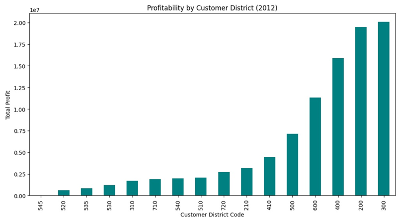
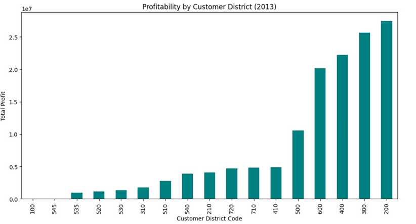
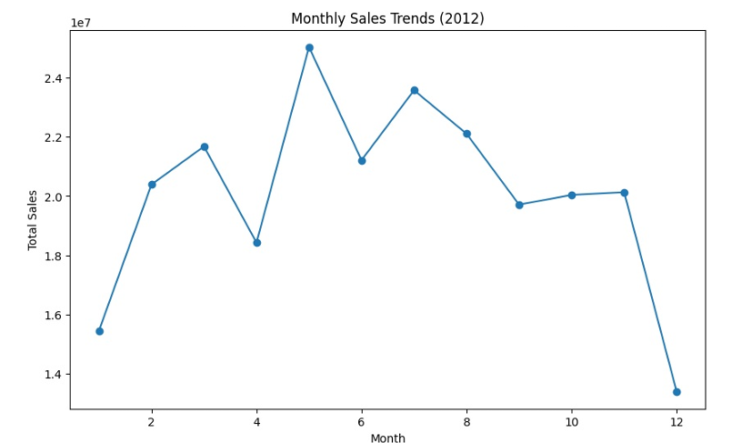
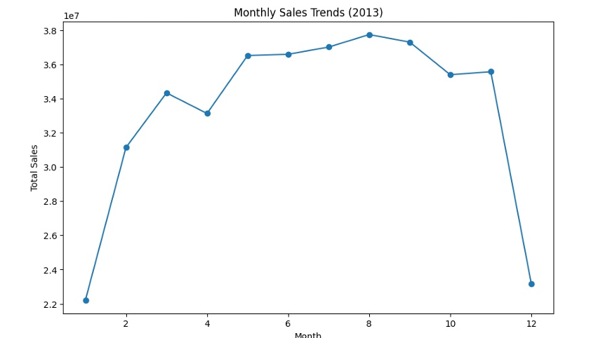
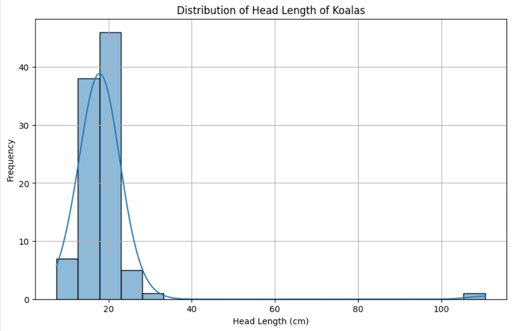
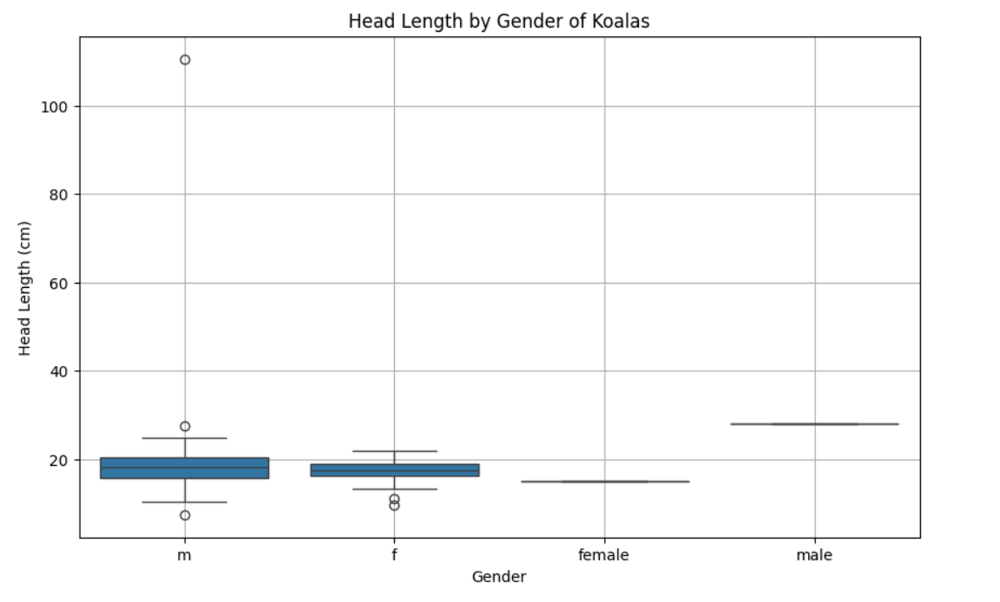
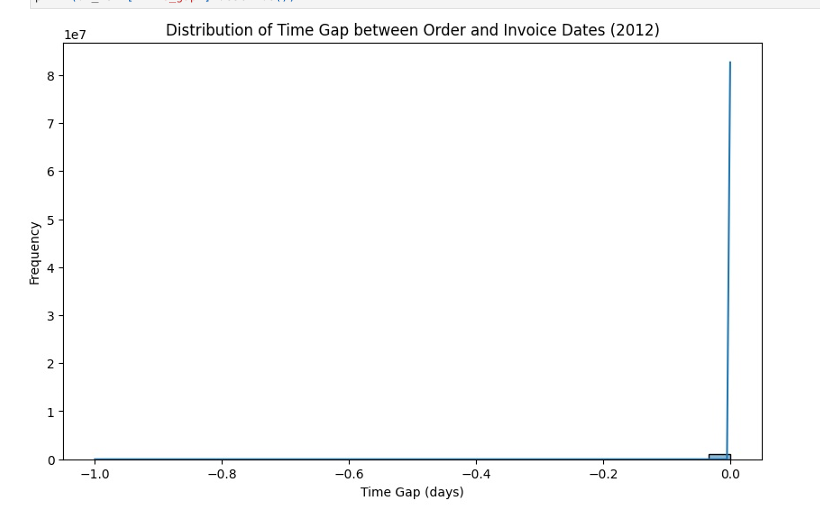
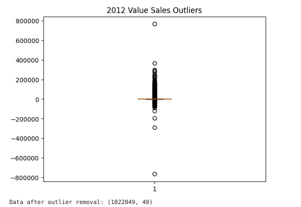
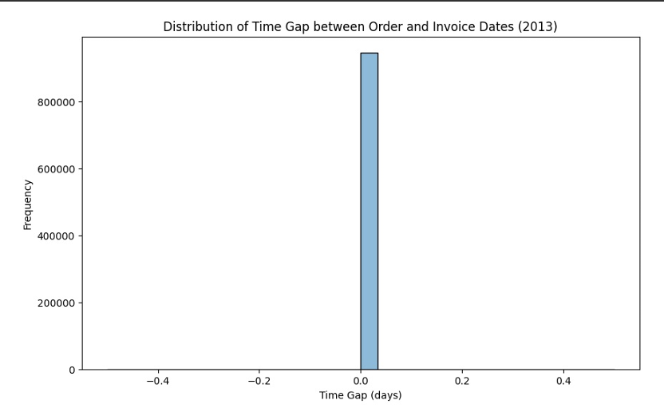
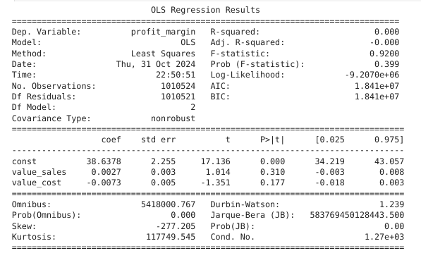

# Python Data Analysis and Machine Learning Tasks

This repository contains Python code for analyzing and processing data using various techniques like **Data Cleaning**, **Visualization**, and **Regression Analysis**. The tasks cover the steps of cleaning, exploring, visualizing, and building regression models to predict and understand business data.

## Overview

The analysis focuses on understanding the relationships within the dataset, including the impact of various features on profitability and sales trends. Visualizations are used to gain insights, and regression models are employed to predict future sales and profitability.

## Table of Contents

- [Data Cleaning](#data-cleaning)
- [Data Visualization](#data-visualization)
- [Regression Analysis](#regression-analysis)
- [Output Images](#output-images)

## Data Cleaning

### 1. **Handling Missing Data**
The first step in cleaning the dataset involves identifying and handling missing values. We used different strategies such as imputation or removal of rows/columns with missing data.

```python
# Code to handle missing data
import pandas as pd

# Load dataset
df = pd.read_csv('data.csv')

# Check for missing values
missing_data = df.isnull().sum()

# Fill missing values with the mean of the column
df.fillna(df.mean(), inplace=True)
```

### 2. **Removing Duplicates**
We also check for duplicate entries and remove them to ensure that our dataset does not contain redundant data.

```python
# Remove duplicates
df.drop_duplicates(inplace=True)
```

### 3. **Handling Outliers**
Outliers were detected using statistical methods (like IQR or Z-Score) and were either removed or treated accordingly.

```python
# Removing outliers using Z-Score
from scipy import stats
df = df[(np.abs(stats.zscore(df)) < 3).all(axis=1)]
```

## Data Visualization

### 1. **Profitability Trend**
We visualized the profitability of the company over time, showing the changes in profitability for the years 2012 and 2013.

- **Profitability in 2012 and 2013**


*Figure 1: Profitability Trend in 2012*


*Figure 2: Profitability Trend in 2013*

### 2. **Sales Trends**
The sales trends for 2012 and 2013 are shown below to illustrate the pattern of sales growth over time.

- **Sales Trend in 2012**


*Figure 3: Sales Trend in 2012*

- **Sales Trend in 2013**


*Figure 4: Sales Trend in 2013*

### 3. **Distribution of Data**
Visualizing the distribution of sales and other metrics, we used histograms and density plots.

- **Distribution of Sales**


*Figure 5: Distribution of Sales*

- **Gender Distribution**


*Figure 6: Gender Distribution of Employees*

### 4. **Data Gaps and Missing Values**
We visualized gaps in data and any potential issues that might arise due to missing or inconsistent data.

- **Data Gap for 2012-2013**


*Figure 7: Data Gaps for 2012-2013*

### 5. **Outliers**
Outliers were detected using boxplots, and the following chart shows the identified outliers in the dataset.

- **Outliers Detection**


*Figure 8: Outliers in the Dataset*

### 6. **Profitability Gap**
This visualization shows how profitability was distributed and where gaps were found in the data for certain periods.

- **Profitability Gap in 2013**


*Figure 9: Profitability Gap for 2013*

## Regression Analysis

### 1. **Regression Model for Sales Prediction**
A regression model was built to predict future sales based on historical data. Below is a visualization of the regression model and its fit to the data.

- **Regression Model for Sales Prediction**


*Figure 10: Regression Model to Predict Sales*

The model was evaluated using different metrics, including **R²** and **Mean Absolute Error (MAE)**. The regression equation was derived to estimate the sales based on independent variables.

### 2. **Sales Gap Analysis**
We analyzed the sales gap for different teams and products by performing regression analysis and identifying any discrepancies or areas of improvement.

## Conclusion

In this repository, we have demonstrated the complete process of cleaning, visualizing, and analyzing business data. Through regression analysis, we predicted future sales and profitability trends, which will help businesses make informed decisions. The visualizations provided clear insights into the data distribution, gaps, outliers, and overall performance.

## Output Images

- **Profitability in 2012**: `assets/profitability2012.png`
- **Profitability in 2013**: `assets/profitability2013.png`
- **Sales Trend in 2012**: `assets/salestrend2012.png`
- **Sales Trend in 2013**: `assets/salestrend2013.png`
- **Sales Distribution**: `assets/distribution.png`
- **Gender Distribution**: `assets/distributiongender.png`
- **Data Gaps**: `assets/gap.png`
- **Outliers in Data**: `assets/outliers_1.png`
- **Profitability Gap in 2013**: `assets/gap1.png`
- **Regression Model**: `assets/regression.png`
